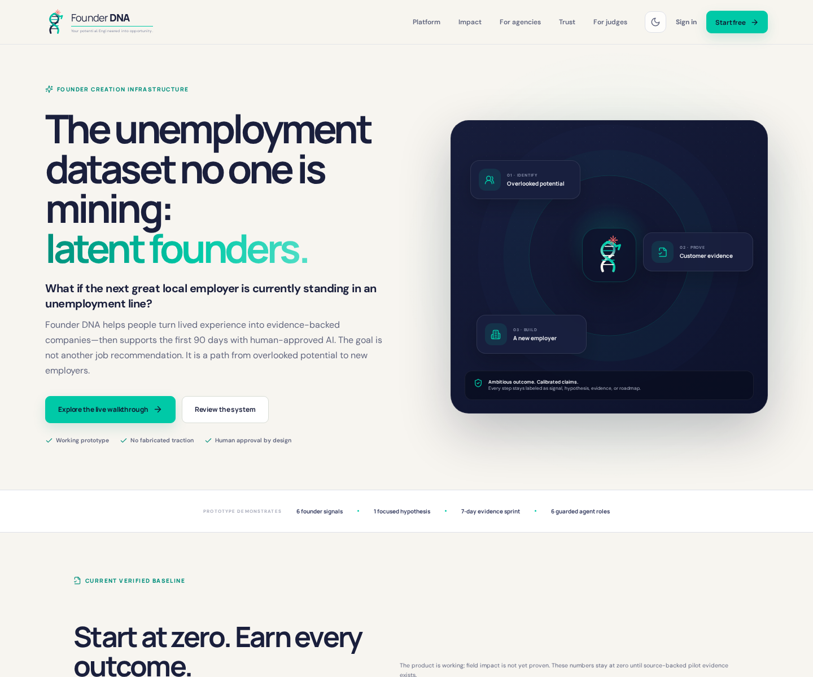
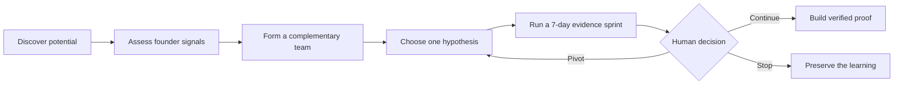
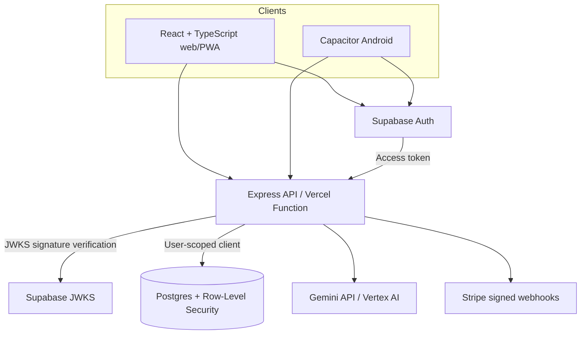

<p align="center">
  
</p>

<p align="center">
  <strong>Evidence-first founder creation and complementary co-founder matching.</strong>
</p>

<p align="center">
  Founder DNA helps people turn lived experience into testable ventures, find
  the operator they are missing, and build a proof trail before making claims.
</p>

<p align="center">
  
  
  
  
</p>

<p align="center">
  <a href="#quick-start">Quick start</a> ·
  <a href="#product-surface">Product</a> ·
  <a href="#architecture">Architecture</a> ·
  <a href="./docs/DEPLOYMENT.md">Deployment</a> ·
  <a href="./SECURITY.md">Security</a>
</p>

---



## The product

Founder DNA is a founder operating system for people whose capability is not
fully represented by a résumé. It combines structured assessment,
complementary founder discovery, AI-assisted validation, and an auditable proof
ledger in one responsive product.

It is deliberately not a founder directory, personality quiz, or unguarded AI
chat interface. Every important output is labeled as self-report, hypothesis,
or verified evidence; consequential actions remain human-approved.

### What makes it different

| Capability | What Founder DNA provides |
| --- | --- |
| Founder signal assessment | Nine operating scenarios scored across six founder traits |
| Complementary matching | Card and grid discovery, compatibility scoring, skill comparison, trust states, and consent-based introductions |
| Validation workflow | A focused opportunity hypothesis, seven-day evidence sprint, decision gates, and printable blueprint |
| AI operations | Server-side Gemini/Vertex AI integration with schema validation, rate limits, receipts, and human checkpoints |
| Proof infrastructure | User-scoped evidence, agent-run, customer, commitment, outcome, revenue, and expense records |
| Agency delivery | Workforce-partner narrative, cohort planner, and downloadable pilot blueprint |
| Cross-platform experience | Responsive web application, installable PWA, and branded Capacitor Android project |

## Product flow



## Product surface

### Public experience

| Route | Purpose |
| --- | --- |
| `/` | Impact narrative and interactive product walkthrough |
| `/how-it-works` | End-to-end founder creation workflow |
| `/matching` | Complementary co-founder matching explanation |
| `/foundry` | Human-guided AI operating model and roadmap |
| `/agencies` | Workforce-agency pilot planner and downloadable brief |
| `/judges` | Fast, transparent product review path |
| `/method` | Scoring, evidence, and decision methodology |
| `/privacy` | Data-use and privacy boundaries |
| `/login`, `/signup`, `/reset-password` | Supabase account lifecycle |

### Authenticated workspace

| Route | Purpose |
| --- | --- |
| `/app` | Founder command center |
| `/app/assessment` | Nine-scenario operating assessment |
| `/app/opportunities` | Clearly labeled opportunity hypotheses |
| `/app/blueprint` | Validation plan and printable founder brief |
| `/app/matches` | Onboarding, discovery, comparison, messages, and intro scheduling |
| `/app/foundry` | Reviewed Gemini founder sprint |
| `/app/proof` | Evidence and AI-run ledger |
| `/app/settings` | Account, infrastructure, export, appearance, and reset controls |

## Architecture



The browser never receives a server secret. The API verifies Supabase access
tokens using the project JWKS endpoint, and database access remains constrained
by Postgres Row-Level Security.

## Quick start

### Requirements

- Node.js 24
- npm 10 or newer
- Chromium dependencies for the optional Playwright suite
- Android SDK and JDK 21 only when building Android

### Run the complete local stack

```bash
git clone YOUR_REPOSITORY_URL
cd DNA-01
npm ci
npm run dev:full
```

Open [http://localhost:4173](http://localhost:4173). The web server proxies
`/api` to the Express service on port `8080`.

Development builds include an explicitly labeled local-review account so the
full workflow can be evaluated without creating production data. That account
is compile-time disabled in production.

## Supabase setup

The repository contains a complete migration for:

- founder profiles;
- evidence events and AI run receipts;
- published matching profiles;
- consent-based connections;
- conversations and messages;
- introduction meetings;
- indexes, integrity triggers, grants, and RLS policies.

Apply the schema once in the Supabase SQL Editor:

```text
supabase/migrations/202607250001_founder_dna.sql
```

Then verify the connected project:

```bash
npm run db:check
```

The command must report all eight application tables before a production
deployment is considered ready.

## Configuration

Copy the example file for local server configuration:

```bash
cp .env.example .env
```

| Variable group | Required for | Notes |
| --- | --- | --- |
| `VITE_SUPABASE_*` | Browser authentication | URL and publishable key only; never expose a secret through `VITE_*` |
| `SUPABASE_URL`, `SUPABASE_PUBLISHABLE_KEY`, `SUPABASE_JWKS_URL` | API authentication and RLS-scoped persistence | Safe identifiers are preconfigured in `.env.example` |
| `SUPABASE_SECRET_KEY` | Optional trusted administrative jobs | Server-only; not required for normal user-scoped requests |
| `GEMINI_API_KEY` or Vertex AI variables | Live Foundry generation | The UI reports an honest unavailable state when omitted |
| `STRIPE_*` | Checkout and signed payment evidence | Keep all Stripe secrets server-only |
| `PUBLIC_APP_URL`, `ALLOWED_ORIGINS` | Production redirects and CORS | Set to the deployed origin |

See [Deployment](./docs/DEPLOYMENT.md) for the complete production procedure.

## Quality gates

Run the same release gate used by continuous integration:

```bash
npm run verify
```

It performs:

1. unit and API tests;
2. a strict TypeScript production build;
3. desktop and mobile Playwright journeys;
4. a moderate-or-higher dependency audit.

The routed browser suite covers public navigation, protected routes, account
recovery, dark mode, assessment completion, matching onboarding and discovery,
profile publishing, communication, settings, proof records, responsive
navigation, PDF delivery, and 404 recovery.

For a production preflight that also checks the live database:

```bash
npm run deploy:check
```

## Deployment

The primary target is Vercel:

```bash
npm run deploy:check
npx vercel
npx vercel --prod
```

`vercel.json` provides SPA deep-link fallback, `/api/*` serverless routing,
security headers, and immutable asset caching. A Dockerfile and Cloud Build
configuration are included for an optional Cloud Run deployment.

Full instructions: [docs/DEPLOYMENT.md](./docs/DEPLOYMENT.md).

## Android

The Android application uses package ID `com.founderdna.app`, the supplied
adaptive launcher icon, a native splash screen, and the animated in-app logo.

```bash
export ANDROID_SDK_ROOT=/absolute/path/to/android-sdk
npm run brand:assets
npm run android:build
```

The command creates `artifacts/FounderDNA-debug.apk`. Production distribution
still requires a private signing key, a production API origin, an Android App
Bundle, and Play Console privacy declarations. Android Studio may provide the
SDK path through the ignored `android/local.properties` file instead.

## Repository structure

```text
.
├── api/                 Vercel serverless entry point
├── android/             Capacitor Android application
├── docs/                Deployment, product-integrity, and visual documentation
├── e2e/                 Desktop and mobile Playwright journeys
├── public/              Brand, PWA, and downloadable agency assets
├── scripts/             Brand, PDF, database, and Android automation
├── server/              Express API, auth, persistence, Gemini, and evidence logic
├── src/                 React application
├── supabase/            Postgres migration and local project configuration
├── vercel.json          Production routing and security headers
└── .github/             CI, dependency updates, and pull-request standards
```

## Release status

| Area | Status |
| --- | --- |
| Web/PWA product | Complete and release-tested |
| Supabase authentication and schema | Implemented; migration must be applied per environment |
| RLS-scoped persistence | Implemented and production-gated by `db:check` |
| Vercel deployment configuration | Ready; environment values and deployment access required |
| Gemini/Vertex AI | Implemented; live generation requires provider credentials |
| Stripe evidence ingestion | Implemented; live use requires signed webhook configuration |
| Android | Verified debug build; release signing remains an owner operation |
| Users, revenue, jobs, and outcomes | Remain zero until source-backed field evidence exists |

## Product integrity

Founder DNA treats restraint as a product feature:

- demo profiles and walkthroughs are explicitly labeled illustrative;
- unverified money never contributes to business-proof totals;
- customer counts are deduplicated;
- AI output is schema-validated and recorded with run metadata;
- private records are isolated with RLS;
- outreach, spending, legal, and other consequential actions require a human;
- the interface does not manufacture traction, accuracy, partnerships, or impact.

Read the complete trust model in
[docs/PRODUCT_INTEGRITY.md](./docs/PRODUCT_INTEGRITY.md).

## Security

Do not commit `.env`, service-account files, Supabase secret keys, Stripe
secrets, evidence-admin keys, Android keystores, or customer source documents.
Report vulnerabilities privately through GitHub Security Advisories as
described in [SECURITY.md](./SECURITY.md).

---

<p align="center">
  <strong>Founder DNA</strong><br />
  Your potential. Engineered into opportunity.
</p>
